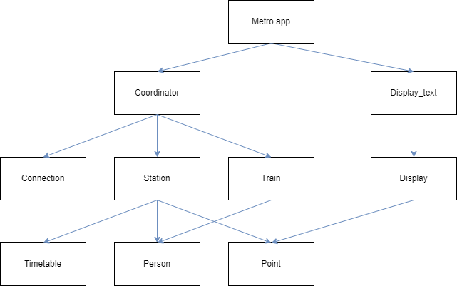
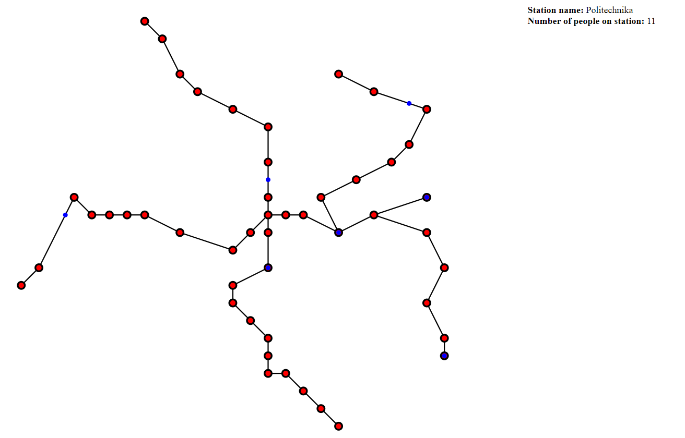

# Autorzy:
 Michał Bogiel, 
 Tomasz Wężowicz, 
 Damian Pałyska 
# Metro simulation
Celem naszego projektu jest symulowanie godziny szczytu w metrze.
Na początku nasz program dostaje pliki csv z danymi o stacjach, połączeniach i pociągach.
Program również dostaje w zmienniej "t" czas rozpoczęcia pracy metra.
Na podstawie tych informacji generowany jest schemat metra, i wypełniany plan odjazdów
(metro pracuje od podanego t do 24 - pociągi znajdujące się wtedy na trasie wracają do stacji początkowych)
Następnie, generowana jest określona liczba ludzi (dana podana w pliku main), którzy dostają losową stację początkową i końcową.
Program wtedy wchodzi do pętli, i wyświetlane jest zapytanie o kolejny krok, przykładowe opcje to - zaktualizowanie mapy html czy ruch metrem o określoną ilość minut.
Przewidziane jest również dodanie kolejnych ludzi do metra, (aplikacja działa do dodania 10 000 osób w trakcie jednej symulacji)
W momencie gdy wszyscy ludzie opuszczą metro, wyświetli się o tym komunikat, jak i czas trwania symulacji.

# Diagram klas

# Hierarchia klas:

- klasa Coordinator\
Zajmuje się połączeniem poszczególnych klas metra.
Przy starcie metra jego zadaniem jest wypełnenie planu odjazdów dla każdej stacji.
Oprócz tego, w nim znajduje się główna logika programu - funkcja "HandleStations" która w każdej swojej iteracji
"rusza" czas lokalny o 1, i wykonuje wszelkie obliczenia związane z działaniem symulacji.
- klasa App\
Nie jest ściśle związana z logiką programu, jej zadaniem jest przeczytanie i obróbka danych dostarczonych z plików.
Następnie, koordynuje ona wyświetlanie tekstu przez display, oraz zajmuje się pętlą w której koordynator wykonuje swoje zadania.
- klasa Display_text\
Zajmuje się wyświetlaniem podstawowych informacji w konsoli
Pozwala wyświetlić stacje i pociągi wraz z ich zapełnieniem oraz mapę metra.
- klasa Display\
Zajmuje się tworzeniem pliku html który przedstawia aktualny stan metra
Główna metoda create_map na początku tworzy nagłówek pliku svg a następnie generuje linie pomiędzy stacjami i punkty w miejscach stacji.
Potem dodawane są pociągi i na samym końcu skrypt umożliwiający wyświetlanie informacji o stacjach i pociągach po najechaniu na nie myszką.

- klasa Connection\
Przechowuje referencje na łączone stacje i czas przejazdu między nimi
- klasa Station\
Przechowuje informacje o stacji : współrzędne, ludzie oczekujący na niej,i rozkład.
- klasa Timetable\
klasa zajmuje się przechowywaniem informacji o jakiej godzinie przyjedzie najbliższy pociąg na stacje i zwróceniem informacji o nim
- klasa Train\
klasa zajmuje się trzymaniem informacji na jaką stacje jedzie pociąg , jaką ma trase,pojemność i kto nim jedzie. Pozadto wylicza jego współrzędne
- klasa punkt\
reprezentuje pare współrzędnych z id  # Mapa
